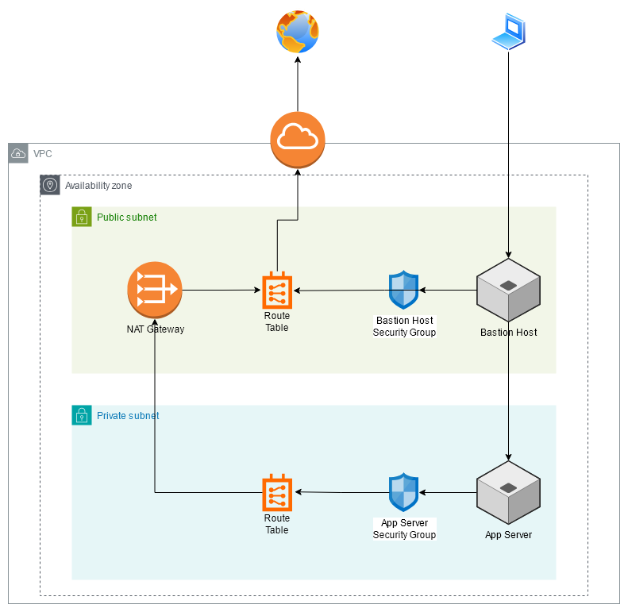

# Creating EC2 Instances

- in this task, i set up
    - an App Server in a private subnet
    - a Bastion Host in a public subnet to access the App Server
    - corresponding Security Groups and Rules for access
    - configured both instances to have my public SSH key

## Architecture Overview

- made on draw.io

## Note

- `my_ip` variable should be considered a placeholder here due to the project being on a free localstack account
- localstack did not auto assign a public IP to the Bastion Host
    - this is potentially due to free account restrictions
    - if want a more complete setup, can create an EIP and associate it with this host
    - keep in mind that EIPs are charged in a real world scenario, whether it is associated to host or not
